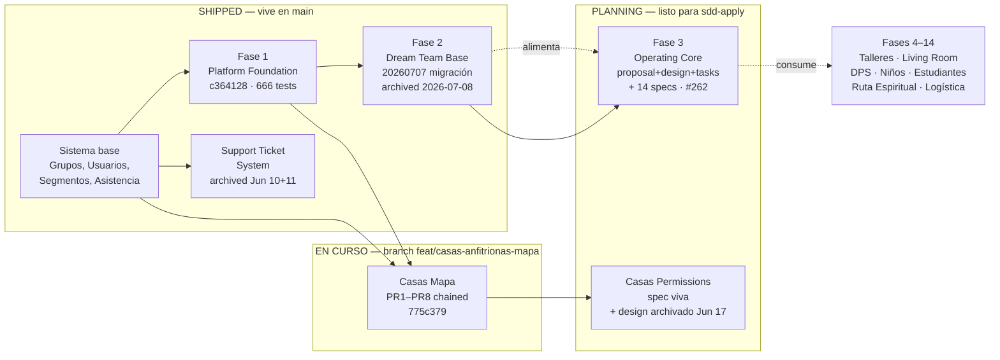
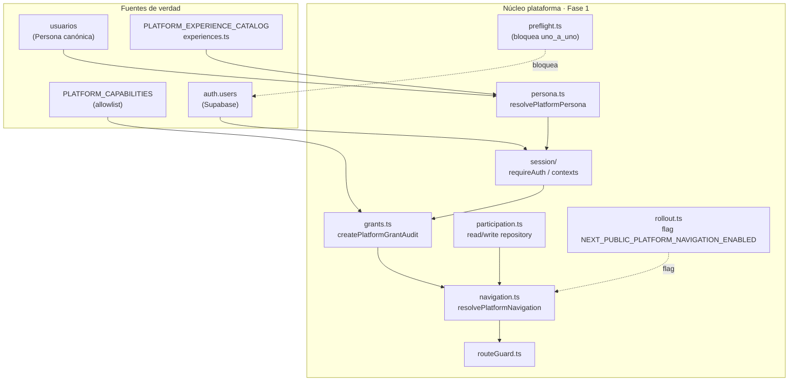
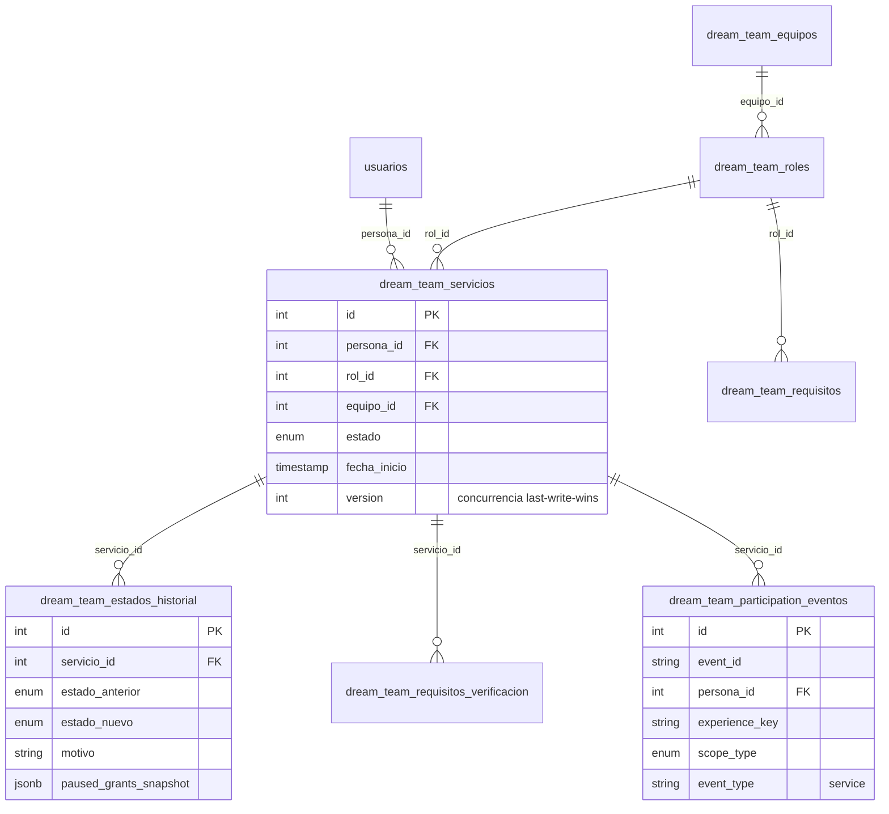
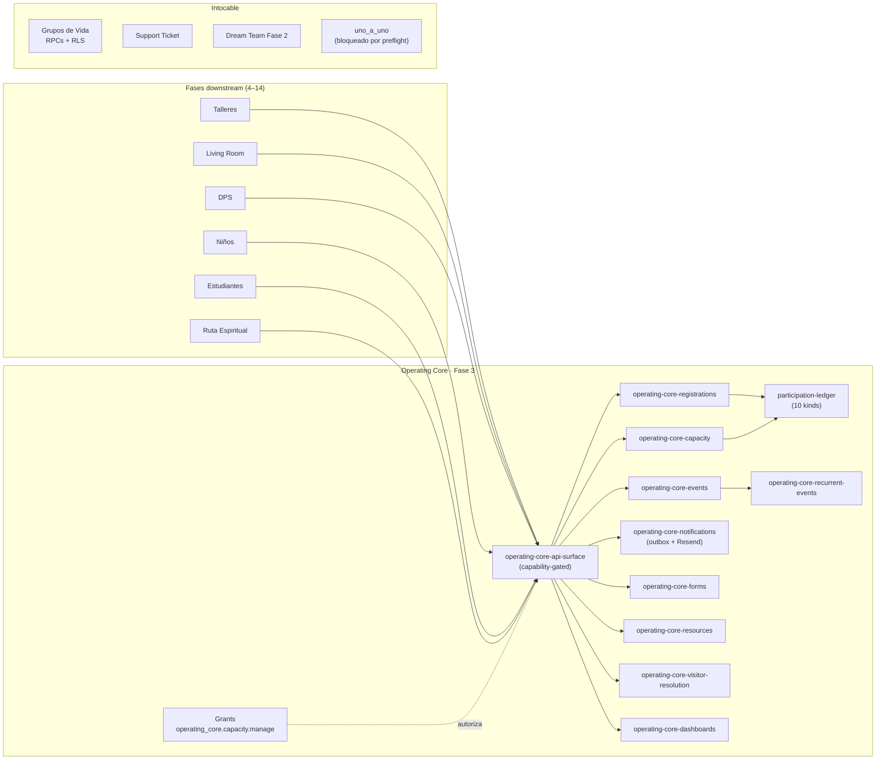
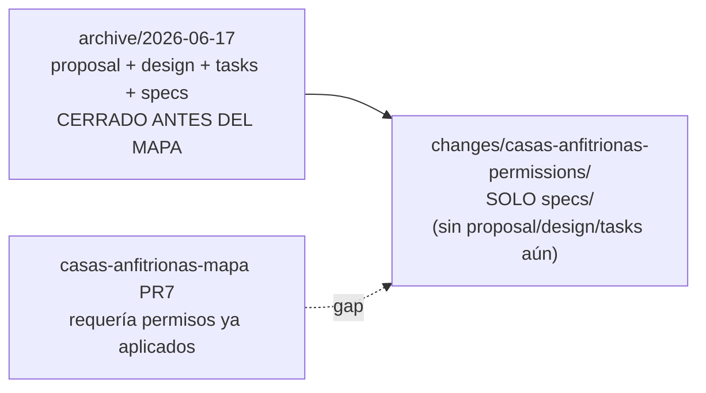
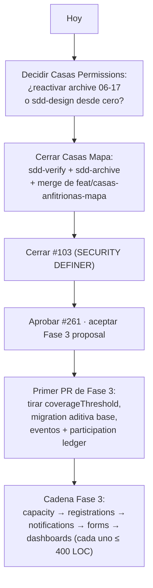

# Reporte Maestro — Plan vs Realidad por Fases

> Generado después de `git pull` (rama `main` en `93688fb`) cruzando:
> `openspec/changes/**`, `openspec/specs/**`, `lib/platform/**`, `supabase/migrations/**`, `docs/`, y git log.
> Este reporte sirve como mapa vivo para alinear lo planeado contra lo construido.

---

## 1) TL;DR del estado actual

| # | Fase / Módulo | Estado | Evidencia |
|---|---|---|---|
| 0 | **Sistema core** (Grupos de Vida, Usuarios, Segmentos, Asistencia, Soporte base) | **DONE — producción** | `app/dashboard/**`, `lib/dashboard/**`, `docs/REPORTE_SISTEMA_COMPLETO.md` |
| 1 | **Fase 1 — Platform Foundation** (Persona única + Capabilities + Grants + Navegación contextual) | **DONE — ship a main** | merge `c364128`, 666 tests, feature flag `NEXT_PUBLIC_PLATFORM_NAVIGATION_ENABLED=off`, módulos en `lib/platform/{persona,experiences,session,grants,participation,navigation,routeGuard,preflight,rollout,flags}.ts` |
| 2 | **Fase 2 — Dream Team Base** (Servicio por persona×equipo×rol, state machine 6 estados, grants, GDV adapter) | **DONE — archivada** | `openspec/changes/archive/2026-07-08-fase-02-dream-team-base/`, migración `20260707183000_dream_team_base.sql`, `lib/platform/dream-team/**` |
| 3 | **Fase 3 — Operating Core** (Eventos, Registros, Capacidad, Forms, Resources, Notificaciones, Visitor resolution, Dashboards) | **PLANNING — esperando `sdd-apply`** | `openspec/changes/fase-03-operating-core/{proposal,design,tasks,exploration}.md` + 14 specs en `specs/`. Sin migración, sin carpeta `lib/platform/operating-core/` aún |
| 4 | **Support Ticket System** (con producción-readiness) | **DONE — archivado** | `openspec/changes/archive/2026-06-10-support-ticket-system/` + `2026-06-11-support-ticket-production-readiness/`; `app/(auth)/ayuda/**`, `app/api/support/**` |
| 5 | **Casas Anfitrionas — Mapa** (Life Group map como fuente de ubicación oficial, capas, colas de revisión) | **DONE — en branch** | `feat/casas-anfitrionas-mapa` con PR1–PR8 (`775c379` y siguientes), migraciones `20260621/22/23_*casas_map*`. `openspec/changes/casas-anfitrionas-mapa/` está en `changes/` (no en archive) → cierre pendiente |
| 6 | **Casas Anfitrionas — Permissions** (granular por rol + scope + estado + sensitive-edit re-review) | **RE-PLANNING (spec + design hechos antes)** | archivado `2026-06-17-casas-anfitrionas-permissions`; nueva carpeta `openspec/changes/casas-anfitrionas-permissions/` contiene solo `specs/` (1 spec). Hmm — el modelo dice "ya deberíamos haber aplicado permisos después del mapa" |
| 7 | **Fase 4 — Enlace exógena + Fase 5+** | **BACKLOG** | Referencias sólo en `fase-03-operating-core/proposal.md §15` y roadmap maestro `globalconnect-roadmap-maestro-v1.md` |

---

## 2) Diagrama macro: roadmap de fases 1 → 3 con dependencias

---

## 3) Fase 1 — Platform Foundation (DONE)

**Intención:** unificar identidad sobre `usuarios` como Persona canónica (auth opcional) y armar el contrato de plataforma (experiencias, capabilities scoped, grants auditables, sesión contextual, navegación, family, historial longitudinal) **sin romper Grupos de Vida**.

### 3.1 Capacidades entregadas (6 specs en `openspec/specs/platform/`)

| Spec | Rol |
|---|---|
| `platform/dream-team` (trasladada desde spec futuro) | Modelo de servicio (Fase 2 dependiente) |
| `platform-persona` | Persona canónica + auth opcional + dedupe |
| `platform-experiences` | Catálogo de experiencias y contextos |
| `platform-scoped-responsibilities` | Capabilities + grants auditables + contrato sesión/menú/dashboard |
| `platform-family-context` | Relaciones familiares, menores/tutores, permisos base |
| `platform-participation-history` | Ledger longitudinal genérico (tipos de eventos) |
| `grupos-vida-platform-compatibility` | Compatibilidad aditiva con GDV (no reemplaza RPCs/RLS) |

### 3.2 Arquitectura del módulo `lib/platform/`

> **Nota operativa:** el flag por defecto está `off` en Vercel. El modelo está listo pero el menú contextual aún no es visible en producción — se activa por rollout gradual.

---

## 4) Fase 2 — Dream Team Base (DONE)

**Intención:** modelar "una persona sirve en una experiencia, en un equipo, con un rol, en un estado, con requisitos auditables" — sin UI operativa aún.

### 4.1 Capacidades entregadas (`openspec/specs/platform/dream-team/spec.md`)

- **Servicio:** triple `(persona, equipo, rol)` en `dream_team_servicios`, N servicios simultáneos por persona
- **Jerarquías configurables:** `dream_team_equipos` + `dream_team_roles` (adjacency list 2-3 niveles, NO rígida)
- **State machine 6 estados:** `postulado → en_orientacion → activo → en_pausa | inactivo → retirado` (+ retorno limitado `pausa→activo`, `inactivo→postulado`)
- **Requisitos:** `dream_team_requisitos` + `dream_team_requisitos_verificacion` (vencidos alertan, **no bloquean**)
- **Hybrid capability model:** genéricas (`dream_team.*` con `experience: 'dream_team'`) + específicas por dominio (`dps.team.*`, `estudiantes.team.*`, etc.)
- **Audit grants:** `grant` en activación, `revoke` en pausa (con `paused_grants_snapshot` JSONB), re-grant automático al volver
- **GDV adapter read-only:** `lib/platform/adapters/dream-team-gdv.ts` mapea líderes GDV → `dream_team.gdv.lead` **sin tocar** `lib/platform/adapters/grupos-vida.ts`
- **Métricas:** `getDreamTeamMetrics()` con `servicios_por_experiencia_equipo`, `servicios_por_estado`, `distribucion_roles`, `requisitos_vencidos` — endpoint, sin widget

### 4.2 Modelo de datos (alto nivel)

### 4.3 Caso de validación "Ana" (del proposal)

Ana sirve **simultáneamente** en:
- **DPS / Producción Técnica / Cámara** como Voluntaria → grant `dps.team.serve`
- **Estudiantes / Transit** como Líder → grants `estudiantes.team.lead` + `dream_team.lead`

Pausar Cámara ⇒ revoca `dps.team.serve`; Estudiantes sigue intacto.
Vencimiento de capacitación Estudiantes ⇒ alerta métrica, **no pausa**.
Pérdida de liderazgo Transit ⇒ Estudiantes pasa a `en_pausa` con motivo `gdv_liderazgo_removed`.

### 4.4 Lo que ya NO es scope de Fase 2 (lo empujó a Fase 3)

- Operación por experiencia (asignar cámaras a eventos)
- Adapter Supabase real de `PlatformParticipationReadRepository` ← **esto es Fase 3**
- UI operativa de asignación, métricas en dashboard

---

## 5) Fase 3 — Operating Core (PLANNING — listo para `sdd-apply`)

**Intención:** *un pipeline único* de eventos/registros/asistencia/capacidad/forms/resources/notifications para que todas las fases downstream (Niños, Estudiantes, TLR, DPS, Talleres, etc.) consuman la misma base.

### 5.1 Capacidades nuevas (14 specs en `openspec/changes/fase-03-operating-core/specs/`)

| Spec | Propósito |
|---|---|
| `operating-core-events` | Taxonomía + recurrencia (`service\|group_meeting\|workshop\|activity\|custom`) |
| `operating-core-services` | Schedules configurables multi-campus |
| `operating-core-visitor-resolution` | Resolución de visitante con `usuarios.cedula` + non-PII |
| `operating-core-registrations` | Lifecycle, idempotencia `(persona_id, event_id)` partial unique, waitlist |
| `operating-core-participation-ledger` | 10 kinds de eventos; `visitor_capture` solo metadata non-PII |
| `operating-core-capacity` | Base/override de capacidad operativa |
| `operating-core-forms` | Schema flexible con submissions |
| `operating-core-resources` | Media library |
| `operating-core-notifications` | Outbox + templates ES |
| `operating-core-dashboards` | Dashboards operativos |
| `operating-core-capture-ux` | Contratos de dominio sobre el ledger (UX neutral) |
| `operating-core-recurrent-events` | RRULE + materialización |
| `operating-core-grupos-vida-bridge` | Adapter read-only GDV |
| `operating-core-api-surface` | Capability + routes |

### 5.2 Arquitectura prevista

### 5.3 Prerrequisitos críticos antes del `sdd-apply`

1. **Issue #103 cerrado** (auditoría SECURITY DEFINER para RPCs del core — el proposal lo liga a P0)
2. **Baseline verde** (PR separado para `mobile-platform-navigation.test.tsx`)
3. Primer PR tira `coverageThreshold` del `jest.config.ts`
4. **Issue #261 aprobado**
5. Cada slice ≤ 400 líneas o `size:exception` documentado

---

## 6) Casas Anfitrionas — Mapa + Permissions (parcialmente shipped)

Dos cambios SDD corrieron en paralelo a las fases del roadmap.

### 6.1 Casas Mapa (DONE — branch `feat/casas-anfitrionas-mapa`)

**Chained PRs entregados** (commits `775c379` y siguientes):

| PR | Tema | Estado |
|---|---|---|
| PR1 | Server actions + wrappers + tests | merged |
| PR2 | Server-action wrappers/tests adicionales | merged |
| PR3 | RPC `obtenerMapaMiembros` + role predicates | merged |
| PR4 | Flujo / listado para asignar Casa Anfitriona | merged |
| PR5 | Centralización rol `canReviewHostHomes` | merged |
| PR6 | Mapa de grupos por casas anfitrionas | merged |
| PR7 | Capa de miembros del mapa | merged |
| PR8 | Backfill guarded + hardens de auth service-role | merged (migración `20260623170000_fix_casas_map_auth_service_role_claims.sql`) |

**Specs vigentes en `openspec/changes/casas-anfitrionas-mapa/specs/`:**
- `life-group-host-home-map`
- `host-home-completeness`
- `host-home-location-review`
- `member-location-map`
- `casas-anfitrionas-permissions` (referenciada, vínculo con 6.2)

### 6.2 Casas Permissions (RE-PLANNING)

**Historia de archivos:**

**El spec vivo (`openspec/specs/casas-anfitrionas-permissions/spec.md`)** exige:

1. **Granularidad por rol:** admin/pastor (todo); director-general (scope director-general); director-etapa (scope etapa, sin approve/reject); líder (sólo create-pending propios); miembro (sólo create-pending propios)
2. **Visibilidad scoped + revalidación:** URL directa, RPCs y server actions revalidan contra las mismas reglas que el listado
3. **UI = server = RPC** (un solo predicado como source-of-truth)
4. **Edición sensible → re-review:** cambios a owner/co-host, dirección, schedule, capacidad → vuelven a `pending` (no se aprueba en automático)
5. **Migración no destructiva** — sin delete/rewrite/backfill de producción

> **⚠️ Gap detectado:** el spec está en `openspec/specs/` pero NO tiene `design.md` ni `tasks.md` en la carpeta del change. El archive de junio sí los tenía. Hay que decidir si se reactiva la versión archivada o si el spec nuevo requiere `sdd-design` + `sdd-tasks` desde cero.

---

## 7) Support Ticket System (DONE)

Dos archivos consecutivos en `openspec/changes/archive/`:

1. **2026-06-10-support-ticket-system** — implementación inicial
2. **2026-06-11-support-ticket-production-readiness** — hardening para producción

Ambos contienen `apply-progress.md` + `verify-report.md` (ciclo completo cerrado).

---

## 8) Lo que consume cada fase futura (extracto del proposal Fase 3 §15)

| Fase futura | Consume de Fase 2/3 |
|---|---|
| **Fase 5 — Talleres de Crecimiento Base** | `dream_team_roles` + `dream_team_requisitos` para configurar líder/co-líder/servidor de cada taller |
| **Fase 6 — The Living Room Operativo** | Roles Dream Team específicos (mentores, hosts universitarios) |
| **Fase 7 — DPS Operations** | `dream_team_equipos` para DPS multiárea (Producción Técnica, Música, Media, Atención al Invitado) |
| **Fase 9 — Niños Operativo** | Servidores de salón (Waumbaland, Upstreet) con requisitos de antecedentes |
| **Fase 10 — Estudiantes Operativo** | Líderes Transit/InsideOut + servidores |
| **Fase 11 — Ruta Espiritual** | Cruce historial Dream Team con journey espiritual |
| **Fase 14 — Logística Voluntarios** | Endpoint de métricas semanal para Cocina/Atención al Voluntario |

---

## 9) Riesgos abiertos y bloqueos reales (sincero)

1. **Casas Permissions** — gap de artefactos (spec OK; sin design/tasks). Aplicar permisos **antes** de cerrar el mapa y unir a `main`.
2. **Casas Mapa** — los PRs viven solo en `feat/casas-anfitrionas-mapa`. La carpeta `openspec/changes/casas-anfitrionas-mapa/` no está archivada, así que tampoco está formalmente cerrada. Requiere `sdd-verify` + `sdd-archive` para sincronizar con `main`.
3. **Fase 3 bloqueada por #103** — la auditoría SECURITY DEFINER no se ha hecho. Sin esto, el proposal dice "Stop".
4. **Fase 1 flag OFF en Vercel** — el menú contextual todavía no es visible. Si se quiere producción real, hay que planificar el rollout gated.
5. **`uno_a_uno`** — bloqueado por `preflight.ts`. Si en algún momento el cliente pide reactivar flujos 1:1, hay que reabrir Fase 1 con decisión explícita.
6. **Coverage threshold** — el primer PR de Fase 3 lo va a tirar (no se reformula con Fase 3); comentar con el equipo.

---

## 10) Próximo paso accionable (mi sugerencia)

---

## Anexo A — Archivos relevantes por fase

### Fase 1
- `lib/platform/{persona,experiences,session,grants,participation,navigation,routeGuard,preflight,rollout,flags,family}.ts`
- `openspec/changes/fase-01-platform-foundation/{proposal,design,tasks,exploration,exploration-4.1,explore-5.1,explore-5.2}.md`
- `openspec/specs/platform/{platform-persona,platform-experiences,platform-scoped-responsibilities,platform-family-context,platform-participation-history,grupos-vida-platform-compatibility}/spec.md`

### Fase 2
- `lib/platform/dream-team/**`
- `lib/platform/adapters/dream-team-gdv.ts`
- `lib/platform/adapters/dream-team.ts`
- `supabase/migrations/20260707183000_dream_team_base.sql`
- `openspec/specs/platform/dream-team/spec.md`
- `openspec/changes/archive/2026-07-08-fase-02-dream-team-base/`

### Fase 3
- `openspec/changes/fase-03-operating-core/{proposal,design,tasks,exploration}.md`
- `openspec/changes/fase-03-operating-core/specs/operating-core-*/spec.md` (×14)

### Casas
- `feat/casas-anfitrionas-mapa` (branch, PR1–PR8)
- `openspec/changes/casas-anfitrionas-mapa/{proposal,design,tasks}.md` + `specs/{life-group-host-home-map,host-home-completeness,host-home-location-review,member-location-map,casas-anfitrionas-permissions}/spec.md`
- `openspec/specs/casas-anfitrionas-permissions/spec.md` (viva)
- `supabase/migrations/20260621{,22,23}*casas_map*`

### Soporte
- `openspec/changes/archive/2026-06-10-support-ticket-system/`
- `openspec/changes/archive/2026-06-11-support-ticket-production-readiness/`
- `app/(auth)/ayuda/**`, `app/api/support/**`
